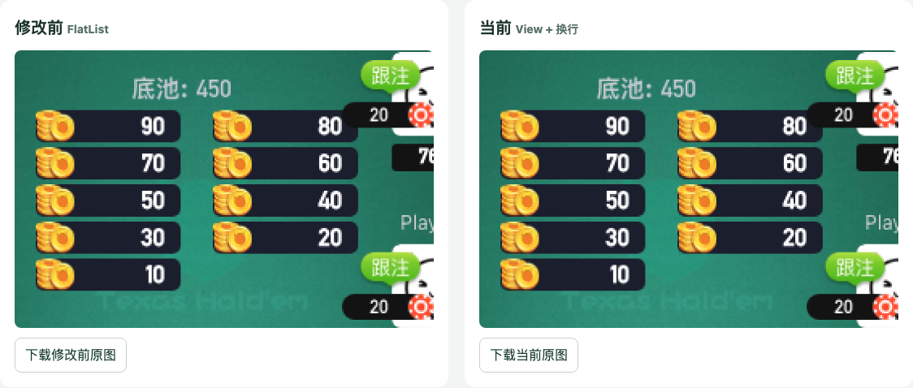

# 德州满桌多底池：修改前后截图对比

[打开离线对比页](comparison.html)，可切换手机／桌面、九个底池／两个底池、整桌／底池放大，并显示像素差异。HTML 已嵌入图片，可单独下载后在浏览器打开；GitHub 源码预览不会执行交互脚本。



本次比较客户端提交 `5d415f480` 修改前的 `Pots.js`、`PotsStyle.js` 与当前部署中的对应组件。两版使用同一份线上应用包，其余模块一致。版本和应用包 SHA-256 见 [provenance.json](provenance.json)。

九人满桌场景回放九个底池 `[90, 80, 70, 60, 50, 40, 30, 20, 10]`，合计 `450`，同时保留 `[120, 60]` 双底池作为已有覆盖的参照。手机为 375×812，桌面为 1440×900；两版、两个视口、两个场景共八张原始截图。

实测九底池在两版均为两列五行，容器高度均为 136 像素；双底池均为一行，容器高度均为 44 像素。各底池金额与矩形坐标完全一致，全部位于容器内。底池区域少量像素变化主要集中在圆角边缘；整图另有头像和文字边缘差异。原始坐标见 [measurements.json](measurements.json)，像素统计见 [differences.json](differences.json)。

本批为 **macOS Chromium 审阅截图**：采集时 Docker 服务无响应。它没有更新正式 Linux 基准，也没有把新状态加入持续集成的截图矩阵；现有 `full_table` 基准仍只包含两个底池。结论只针对本批 Web 渲染，不能据此推断 iOS／Android 的布局。

## 复现

以下命令从 `clrn/visual` 运行。先安装 clrn 的现有依赖和 Chromium，并配置现有 mitmproxy；客户端依赖用于编译历史源码和生成图片，客户端工作区保持只读。

```sh
export COMPARISON_CLIENT_REPOSITORY=/absolute/path/to/laiwan_react_native
# 客户端工作区没有依赖时，指向已安装依赖的客户端目录。
export COMPARISON_DEPENDENCY_DIRECTORY=/absolute/path/to/laiwan_react_native/node_modules
export COMPARISON_SHARP_PATH=/absolute/path/to/laiwan_react_native/node_modules/sharp
export MITMDUMP_PATH=/absolute/path/to/mitmdump
export VISUAL_SUITE=texas
export VISUAL_LOCALES=zh-Hans

node comparisons/pots-2026-10-10/prepare-bundles.cjs
node ../scripts/with-test-account.mjs -- bash -c '
  set -e
  VISUAL_AUTH_USES_MITMPROXY=true node --import tsx src/captureAuthState.ts
  node --import tsx comparisons/pots-2026-10-10/capture.ts
'
node comparisons/pots-2026-10-10/build-report.cjs
node comparisons/pots-2026-10-10/verify-report.cjs
```

准备脚本只替换底池组件及对应样式模块。模块编号绑定本次记录的部署，部署模块变化时明确失败，需要重新核对依赖映射。应用仍经过正常初始化、真实登录、创建和进入私人房；牌局只在网络边界通过现有德州代理回放，结束时解散本次创建的房间。

`COMPARISON_VERSION=current` 或 `previous` 可只采集一版；默认先采集当前版，再采集修改前组件。生成报告和校验已有图片可以离线执行，不登录、不建房。

应用包、历史源码缓存、房间清理记录和失败截图由本目录 `.gitignore` 排除，登录态仍沿用 `visual/auth-state.json` 的忽略规则。提交内容不包含凭据或网络正文。
